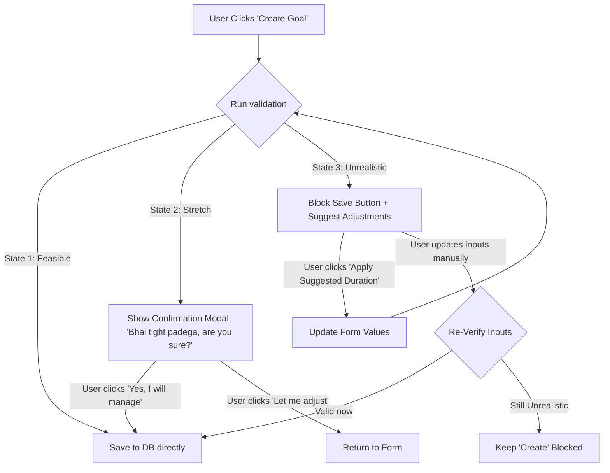

# Phase 3: Guidance (Core USP)

This phase shifts MAD from a tracking and analytical application into an active financial advisory tool, suggesting spending adjustments and validating savings goals before creation.

* **Status:** **Completed** ✅

---

## 🗄️ Database Layer

To implement savings goals and track financial rules, we will establish the `goals` table:

```sql
CREATE TABLE IF NOT EXISTS goals (
  id INTEGER PRIMARY KEY AUTOINCREMENT,
  userId TEXT NOT NULL DEFAULT 'local-user',
  title TEXT NOT NULL,
  targetAmount REAL NOT NULL,
  currentAmount REAL NOT NULL DEFAULT 0,
  durationMonths INTEGER NOT NULL,
  priority INTEGER NOT NULL CHECK(priority IN (1, 2, 3)), -- 1=Low, 2=Medium, 3=High
  targetDate TEXT NOT NULL,
  monthlyRequired REAL NOT NULL,
  isCompleted INTEGER NOT NULL DEFAULT 0,
  createdAt TEXT NOT NULL DEFAULT (datetime('now', 'localtime'))
);
```

> [!NOTE]
> The `userId` column kept its original `TEXT NOT NULL DEFAULT 'local-user'` definition for backward compatibility, but since the Phase A account-system rebuild ([project_documentation.md § Account System](file:///d:/Project/My-Mini-Projects/M.A.D%28Money%20Analysis%20and%20Decisions%29/docs/project_documentation.md)), every goal is created and fetched scoped to the real authenticated `req.session.userId` — `getActiveGoals`, `insertGoal`, `updateGoalProgress`, and `deleteGoal` all filter/insert on it, so each account only ever sees and manages its own goals.

### Prepared Statements
* **`insertGoal`**: Writes a target savings goal (amount, duration, priority, and required monthly allocation).
* **`getActiveGoals`**: Fetches all goals sorted by priority.
* **`updateGoalProgress`**: Allocates monthly surplus to goals and marks completions.

---

## ⚙️ Backend Layer

### Endpoints
* **`GET /api/insights/overview`**: Evaluates categories to compile Hinglish advice alerts.
* **`POST /api/goals/validate`**: Validates a proposed target based on user financials and returns a feasibility classification.
* **`POST /api/goals`**: Inserts a validated target goal.
* **`GET /api/goals`**: Returns all targets with priority-allocated savings progress.

---

## 📊 Core Algorithms & Logic

### 1. Expenditure Segregation (50/30/20 Rule)
For advisory assessments, transaction categories are grouped into three segments:
1. **Wants (Discretionary Expenses)**: `Food` (restaurants/Swiggy), `Shopping`, `Smoking`, `Alcohol`, `Others`. Target for budget reduction suggestions.
2. **Needs (Essential Bills & Fixed Expenses)**: `Housing` (Rent, utilities, electricity), `Subscription` (recharges, internet), `Health`, `Travel` (commute/petrol).
3. **Savings & Wealth (Investments)**: `Finance` (SIP, Mutual Funds, Gold, Stocks). Tracked as asset-building surpluses, rather than standard expenses, to maintain a realistic *Savings Rate*.

### 2. Proactive Goal Feasibility Engine
Evaluates if a savings goal is realistic before allowing addition.
* **Proposed Target**: Amount $T$, Duration $M$ months. Required Monthly Saving $R = \frac{T}{M}$.
* **User Parameters**: Monthly fixed income $I$, and Historical Average Monthly Savings $S_{\text{avg}}$ (calculated from `Income - Expense` logs).

#### Feasibility Classifications:
* **State 1: Feasible ($R \le S_{\text{avg}}$)**: Saving rate matches historical aggregates. Saved directly.
* **State 2: Stretch Goal ($S_{\text{avg}} < R \le 0.5 \times I$)**: Achievable with disciplined budgeting (requires saving $< 50\%$ of income). Triggers a **Confirmation Check Modal** asking: *"Bhai, are you sure? Tight budget rhega."*
* **State 3: Unrealistic ($R > 0.5 \times I$)**: Mathematically impossible or leaves $<50\%$ income for needs and obligations. **Blocks creation** and displays recommended target adjustments (extended duration or reduced target amount).



---

## 🎨 Frontend Layer & UX Elements

1. **Auto-Dismissing Alerts**:
   * Critical limit breaches trigger a custom **Jarvis Alert** popup that slides in and auto-dismisses after 4-5 seconds.
2. **Advice Center Icon**:
   * A glowing Brain/Chat icon (🧠 / 💬) in the top header. Clicking it expands a notification log displaying persistent advice cards so tips are not lost.
3. **Enforced Goal Verification UI**:
   * Displays real-time checks inside the Goal Modal. Disabled save state when in State 3, unlocking only when realistic numbers are set.
4. **Goals Card Grid**:
   * Visual progress bars detailing completion stats (e.g., `₹27,500/₹50,000 (55%)`).
