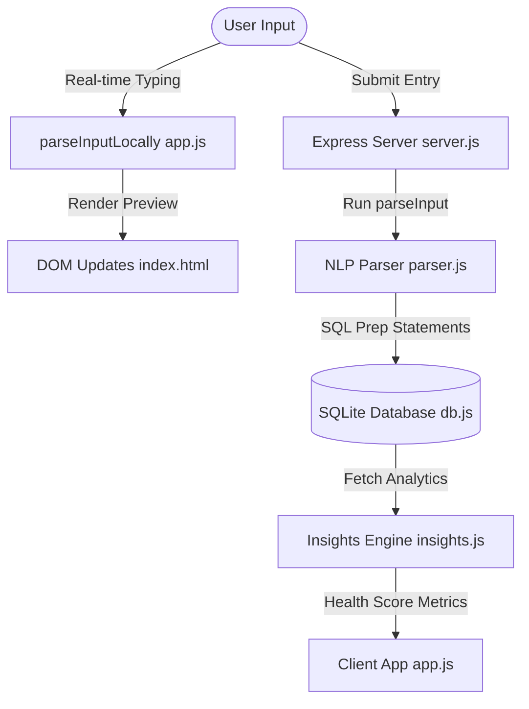

# M.A.D (Money Analysis & Decisions) — Project Documentation

Welcome to the technical documentation of the **M.A.D (Money Analysis & Decisions)** project. This document outlines the system architecture, database designs, parsing logic, health score equations, and detailed phase-by-phase status reporting.

---

## 🛠️ System Overview & Tech Stack

The application follows a lightweight, single-repo structure split into a Frontend client and a Node.js Express backend.



### Tech Stack Details

* **Frontend**: Pure **HTML5**, **Vanilla CSS3** (styled with customized CSS custom variables, gradients, and custom scrollbars), and **Vanilla JavaScript (ES6)** using DOM APIs. Graphs are generated using standard canvas-free SVG paths and CSS gradients.
* **Backend**: **Express.js** REST API using standard middlewares (`cors` and `express.json`).
* **Authentication**: **Session-based auth** via `express-session` backed by a persistent `better-sqlite3-session-store` (so sessions survive server restarts), `httpOnly` cookies, and `bcrypt` password hashing. Chosen over JWTs specifically to avoid rewriting the ~30 existing `fetch()` calls in `app.js` with `Authorization` headers — the browser sends the session cookie automatically.
* **Database**: **SQLite** (managed via `better-sqlite3` in WAL mode for synchronous file writing and optimized throughput).

> [!IMPORTANT]
> As of the **multi-user rebuild (Phase A)**, M.A.D is no longer a single-player, hardcoded `'local-user'` app. Every account is now a real, password-protected identity backed by the new `users` table, and every existing feature (transactions, goals, insights, automation, friends, ledger) is scoped to `req.session.userId` — verified via two-account isolation testing (Account A's data never leaks into Account B's views, and vice versa).

---

## 🔐 Account System (Authentication & Sessions)

* **Status:** **Completed** ✅ — *(Phase A of the in-progress multi-user rebuild; see [phase_5_social.md](file:///d:/Project/My-Mini-Projects/M.A.D%28Money%20Analysis%20and%20Decisions%29/docs/phase_5_social.md) for the remaining phases B–F.)*

This system replaced the original single-user model — where every table defaulted `userId` to the hardcoded literal `'local-user'` — with real, independently-authenticated accounts.

#### Backend (Implemented)
* **`users` Table**: Stores `username`, `email`, a `bcrypt`-hashed `passwordHash`, and an optional `displayName` (see schema below).
* **`backend/routes/auth.js`**: Exposes `POST /signup`, `POST /login`, `POST /logout`, `GET /me`.
* **Input Validation Rules**:
  * **Username**: 3–20 characters; regex `/^(?=.{3,20}$)[a-zA-Z0-9_]+(?: [a-zA-Z0-9_]+)*$/` — letters, digits, underscores, and **single internal spaces** (e.g. `"Prasanna Tulapurkar"` is valid; leading/trailing/double spaces are rejected).
  * **Email**: Must pass a basic format check (`/^[^\s@]+@[^\s@]+\.[^\s@]+$/`).
  * **Password**: Minimum 6 characters (no additional complexity constraints).
* **`backend/middleware/requireAuth.js`**: Rejects any request without `req.session.userId` with `401 Not authenticated`, mounted in front of every router except `/auth` itself.
* **Sessions**: `express-session` with a `better-sqlite3-session-store` backing store (persisted in `mad.db`, not in-memory) so logins survive server restarts; cookies are `httpOnly` with `sameSite: 'lax'`.
* **The userId-leak fix**: Every prepared statement and inline query across `transactions.js`, `goals.js`, `automation.js`, `insights.js`, `friends.js`, `ledger.js`, and `services/healthScore.js` was audited and given an explicit `userId = @userId` filter sourced from `req.session.userId` — closing the gap where, pre-rebuild, `goals`, `recurring_bills`, and analytics aggregates had no `userId` `WHERE` clause at all and would have silently mixed two accounts' data the moment a second account existed.

#### Frontend (Implemented)
* **Auth Overlay**: A full-screen `#auth-overlay` (login/signup tabs, styled with the existing `.modal__*` component classes for visual consistency) blocks the app shell until a session is confirmed. A `body.authenticated` class toggle prevents a flash-of-unstyled-content (FOUC) where the dashboard would briefly flash before the overlay covers it.
* **Dark/Light Mode Toggle on Auth Screen**: A `#auth-theme-toggle` button (moon/sun icon, top-right corner of the overlay) lets users pick their preferred colour scheme *before* logging in. It is wired to the same shared `toggleTheme()` function as the in-app topbar toggle, so one click on either button keeps both in sync. Theme is persisted to `localStorage` under `mad-theme` and applied to `<html data-theme="dark">` before the session check runs, so the auth screen always respects the saved preference rather than defaulting to light.
* **Mood Accent on Auth Screen**: The Mood Engine (see Phase 6) derives `data-mood` from the user's health score and saves it to `localStorage` under `mad-mood`. On every page load — including while the auth overlay is visible — the saved mood is restored to `<html data-mood="…">` before the session check, so the auth screen's accent color (red/amber/teal) already matches the accent the user will see once logged in.
* **Session Check on Load**: `checkSession()` calls `GET /api/auth/me` on `DOMContentLoaded`; a `401` shows the auth overlay, success hides it and populates the profile menu.
* **Profile Menu**: The previously-inert `#profile-icon` now opens a dropdown showing the account's avatar initial, display name, and email, plus a **Log out** action.
* **401 Interceptor**: `window.fetch` is monkey-patched once (rather than touching the ~30 existing `fetch()` call sites) to detect a `401` from any `/api/*` route (other than `/api/auth/*`) and re-show the auth overlay — handles session expiry mid-use gracefully.

#### "Done" criteria — verified
* A fresh browser with no cookie sees the login/signup screen, not the dashboard.
* Two independently-created accounts (tested live with separate Playwright browser contexts) never see each other's transactions, goals, friends, or ledger entries — proving the userId-leak fix closes the gap for every affected query.
* Logging out and back in, and reloading mid-session, both behave correctly; the session persists via the SQLite-backed store rather than disappearing on server restart.

---

## 🗄️ Database & Schema Details

All transactions are stored in a local SQLite file ([mad.db](file:///d:/Project/My-Mini-Projects/M.A.D%28Money%20Analysis%20and%20Decisions%29/backend/mad.db)). The schema is defined in [db.js](file:///d:/Project/My-Mini-Projects/M.A.D%28Money%20Analysis%20and%20Decisions%29/backend/db.js).

### Tables & Fields

#### 1. `users` Table
| Column Name | Data Type | Constraint / Default | Description |
| :--- | :--- | :--- | :--- |
| `id` | `INTEGER` | `PRIMARY KEY AUTOINCREMENT` | Auto-incremented account identifier — this is the real, integer `userId` stored in `req.session.userId` after login and threaded through every other table's `userId` column. |
| `username` | `TEXT` | `NOT NULL UNIQUE` | Unique handle used for login and friend search. |
| `email` | `TEXT` | `NOT NULL UNIQUE` | Unique email address; alternate login identifier. |
| `passwordHash` | `TEXT` | `NOT NULL` | `bcrypt` hash of the account password — plaintext passwords are never stored. |
| `displayName` | `TEXT` | `NULL` | Friendly name shown in the profile menu and (in future phases) to linked friends. |
| `createdAt` | `TEXT` | `NOT NULL DEFAULT (datetime('now', 'localtime'))` | Account creation timestamp. |

#### 2. `transactions` Table
| Column Name | Data Type | Constraint / Default | Description |
| :--- | :--- | :--- | :--- |
| `id` | `INTEGER` | `PRIMARY KEY AUTOINCREMENT` | Auto-incremented transaction identifier. |
| `userId` | `TEXT` | `NOT NULL DEFAULT 'local-user'` | Owning account. The column keeps its original `TEXT` type and `'local-user'` default for backward compatibility with pre-auth rows, but every new row stores the real authenticated `req.session.userId` (the integer `users.id`), and every read/write query filters on it. |
| `amount` | `REAL` | `NOT NULL` | Numeric transaction value (e.g., `250.50`). |
| `type` | `TEXT` | `NOT NULL CHECK(type IN ('income', 'expense'))` | Type discriminator flag. |
| `category` | `TEXT` | `NOT NULL` | Expense/Income tag (e.g., `Food`, `Alcohol`, etc.). |
| `note` | `TEXT` | `NULL` | Raw metadata/additional text supplied by the user. |
| `date` | `TEXT` | `NOT NULL` | Standard ISO timestamp generated at creation. |
| `isIncorrect` | `INTEGER` | `NOT NULL DEFAULT 0` | Flag used to soft-delete incorrect entries (`0` = Active, `1` = Deleted). |
| `createdAt` | `TEXT` | `NOT NULL DEFAULT (datetime('now', 'localtime'))` | SQLite timestamp used for monthly query clustering. |

#### 3. `goals` Table
| Column Name | Data Type | Constraint / Default | Description |
| :--- | :--- | :--- | :--- |
| `id` | `INTEGER` | `PRIMARY KEY AUTOINCREMENT` | Auto-incremented goal identifier. |
| `userId` | `TEXT` | `NOT NULL DEFAULT 'local-user'` | Owning account (real `req.session.userId`, scoped per-account — see note on the `transactions.userId` column above). |
| `title` | `TEXT` | `NOT NULL` | Title of the savings goal (e.g., `"New Laptop"`). |
| `targetAmount` | `REAL` | `NOT NULL` | Target amount in rupees to be saved. |
| `currentAmount` | `REAL` | `NOT NULL DEFAULT 0` | Current savings progress allocated to this goal. |
| `durationMonths` | `INTEGER` | `NOT NULL` | Plan duration in months. |
| `priority` | `INTEGER` | `NOT NULL CHECK(priority IN (1, 2, 3))` | Goal priority (1 = Low, 2 = Medium, 3 = High). |
| `targetDate` | `TEXT` | `NOT NULL` | Computed target deadline date. |
| `monthlyRequired` | `REAL` | `NOT NULL` | Computed monthly savings required to meet target. |
| `isCompleted` | `INTEGER` | `NOT NULL DEFAULT 0` | Completion status flag (`0` = Active, `1` = Completed). |
| `createdAt` | `TEXT` | `NOT NULL DEFAULT (datetime('now', 'localtime'))` | Creation timestamp. |

#### 4. `recurring_bills` Table
| Column Name | Data Type | Constraint / Default | Description |
| :--- | :--- | :--- | :--- |
| `id` | `INTEGER` | `PRIMARY KEY AUTOINCREMENT` | Auto-incremented recurring template identifier. |
| `userId` | `TEXT` | `NOT NULL DEFAULT 'local-user'` | Owning account (real `req.session.userId`, scoped per-account). |
| `amount` | `REAL` | `NOT NULL` | Payment amount in rupees. |
| `category` | `TEXT` | `NOT NULL` | Expense category. |
| `note` | `TEXT` | `NULL` | Transaction details. |
| `frequency` | `TEXT` | `NOT NULL CHECK(frequency IN ('daily', 'weekly', 'monthly', 'yearly'))` | Billing frequency. |
| `dueDate` | `TEXT` | `NOT NULL` | Next expected payment date. |
| `lastLoggedDate` | `TEXT` | `NULL` | Timestamp of the last time this bill was logged. |
| `isActive` | `INTEGER` | `NOT NULL DEFAULT 1` | Status flag (`1` = Active template, `0` = Deactivated). |
| `createdAt` | `TEXT` | `NOT NULL DEFAULT (datetime('now', 'localtime'))` | Creation timestamp. |

#### 5. `friends` Table
| Column Name | Data Type | Constraint / Default | Description |
| :--- | :--- | :--- | :--- |
| `id` | `INTEGER` | `PRIMARY KEY AUTOINCREMENT` | Auto-incremented friend identifier. |
| `userId` | `TEXT` | `NOT NULL DEFAULT 'local-user'` | Owning account (real `req.session.userId`, scoped per-account). |
| `name` | `TEXT` | `NOT NULL` | Free-text display name of the friend (not yet a linked account — see [phase_5_social.md](file:///d:/Project/My-Mini-Projects/M.A.D%28Money%20Analysis%20and%20Decisions%29/docs/phase_5_social.md) for the planned account-linking rebuild). |
| `upiId` | `TEXT` | `NULL` | Optional UPI ID for settling debts. |
| `createdAt` | `TEXT` | `NOT NULL DEFAULT (datetime('now', 'localtime'))` | Creation timestamp. |

> [!NOTE]
> A `users` row is created per real account (Phase A), but `friends` rows are still private, free-text labels owned by one account — "Rohan" in Alice's `friends` table has no relationship to a real account named Rohan, even if one exists. Linking real accounts as friends (so both sides see a shared ledger) is the subject of the in-progress Phases B–F rebuild documented in [phase_5_social.md](file:///d:/Project/My-Mini-Projects/M.A.D%28Money%20Analysis%20and%20Decisions%29/docs/phase_5_social.md).

#### 6. `splits` Table
| Column Name | Data Type | Constraint / Default | Description |
| :--- | :--- | :--- | :--- |
| `id` | `INTEGER` | `PRIMARY KEY AUTOINCREMENT` | Auto-incremented split identifier. |
| `transactionId` | `INTEGER` | `NOT NULL REFERENCES transactions(id)` | Links to parent transaction. |
| `friendId` | `INTEGER` | `NOT NULL REFERENCES friends(id)` | Links to the friend responsible for the split. |
| `splitAmount` | `REAL` | `NOT NULL` | Friend's share of the transaction amount. |
| `isSettled` | `INTEGER` | `NOT NULL DEFAULT 0` | Settlement status flag (`0` = Outstanding, `1` = Settled). |
| `settledDate` | `TEXT` | `NULL` | Timestamp of when this split was settled. |
| `createdAt` | `TEXT` | `NOT NULL DEFAULT (datetime('now', 'localtime'))` | Creation timestamp. |

### Prepared SQL Statements
Optimized database requests are pre-compiled in [db.js](file:///d:/Project/My-Mini-Projects/M.A.D%28Money%20Analysis%20and%20Decisions%29/backend/db.js):

#### Auth & Account Statements:
* **`insertUser`**: Creates a new account with a `bcrypt`-hashed password.
* **`getUserByEmail`** / **`getUserByUsername`**: Case-insensitive lookups used during login to resolve an identifier to an account.
* **`getUserById`**: Resolves the session's `userId` to account details (`id`, `username`, `email`, `displayName`, `createdAt` — never `passwordHash`) for `GET /api/auth/me` and the profile menu.

#### Transaction Statements:
* **`insertTransaction`**: Writes a parsed transaction to database.
* **`getRecentTransactions`**: Fetches the 5 most recent active (`isIncorrect = 0`) rows.
* **`getAllTransactions`**: Pulls the entire transaction history sorted by newest.
* **`updateTransaction`**: Updates fields of an active transaction.
* **`softDeleteTransaction`**: Toggles `isIncorrect = 1` for a specific transaction (Soft Delete).

#### Analytics Statements:
* **`getCurrentMonthTotals`**: Computes totals for active transactions in the current calendar month.
* **`getCategoryBreakdown`**: Computes monthly expenses aggregated by category.
* **`getActiveDays`**: Counts unique calendar days with logged transactions.
* **`getDailySpending`**: Computes daily aggregate spend over the last 30 calendar days.
* **`getMonthSummary`**: Aggregate count and volume summaries for income vs. expense.
* **`getAllCategoryBreakdown`**: Groups all types of spending for donut breakdown legends.

#### Savings Goals Statements:
* **`insertGoal`**: Saves a validated savings goal to the database.
* **`getActiveGoals`**: Fetches all goals ordered by priority and creation date.
* **`updateGoalProgress`**: Modifies a goal's current progress amount and completion status.
* **`getGoalById`**: Retrieves a single goal.
* **`deleteGoal`**: Removes a savings goal from the database.
* **`getHistoricalSavings`**: Computes average historical monthly savings.

#### Automation Statements:
* **`insertRecurringBill`**: Saves a new subscription / recurring commitment template.
* **`getRecurringBills`**: Retrieves all active recurring templates.
* **`updateRecurringBillDueDate`**: Updates the next due date and last logged date.
* **`deleteRecurringBill`**: Deactivates a recurring bill template.

#### Social & Split Statements:
* **`insertFriend`**: Creates a new friend record.
* **`getFriendByName`**: Case-insensitive lookup used to deduplicate friends by name.
* **`getAllFriends`**: Fetches all friends of the user, sorted alphabetically.
* **`insertSplit`**: Saves a friend's split share of a transaction.
* **`getLedgerBalances`**: Aggregates outstanding net balances for each friend.
* **`settleFriendDebts`**: Marks all outstanding splits for a friend as settled.

---

## 🧠 Core Algorithm Components

### 1. NLP Parser Engine
The transaction parser operates on keyword lookup and regex parsing rules. It is mirrored on both the client side ([parseInputLocally](file:///d:/Project/My-Mini-Projects/M.A.D%28Money%20Analysis%20and%20Decisions%29/frontend/app.js#L120)) and server side ([parseInput](file:///d:/Project/My-Mini-Projects/M.A.D%28Money%20Analysis%20and%20Decisions%29/backend/parser.js#L186)).

* **Regex Amount Extraction**: `cleanedInput.match(/(\d+(?:\.\d+)?)/)` isolates the first integer or decimal value as the `amount`.
* **Keyword Matching**: Splits the description text and looks up matches in `CATEGORY_MAP` (e.g., `swiggy` maps to `Food`, `sutta` to `Smoking`, `beer` to `Alcohol`).
* **Type Resolution**: Matches the text against `INCOME_KEYWORDS` or checks if the string starts with `+` to tag it as `income`. Otherwise, defaults to `expense`.
* **Split Intent Extraction**: Uses regex pattern `/split with\s+([a-zA-Z0-9_]+)/i` to capture target friend name for automatic split allocation, stripping it from the note before categorization.

### 2. Money Health Score Calculation
Computed in [healthScore.js](file:///d:/Project/My-Mini-Projects/M.A.D%28Money%20Analysis%20and%20Decisions%29/backend/services/healthScore.js#L30), the score is a weighted average of four indices ($0 \text{ to } 100$):

$$\text{Health Score} = 0.35 \times S + 0.20 \times D + 0.25 \times C + 0.20 \times E$$

#### Breakdown of Indices:
1. **Savings Rate ($S$) — 35% Weight**:
   * Calculated as: $\frac{\text{Income} - \text{Expense}}{\text{Income}}$
   * If $\ge 20\%$, $S = 100$.
   * If $\ge 10\%$ and $< 20\%$, $S = 70 \text{ to } 100$.
   * If $< 0$ (debt spending), $S = \text{clamped between } 0 \text{ and } 30$.
2. **Spending Diversity ($D$) — 20% Weight**:
   * Measures spending awareness.
   * Less than $2$ categories spent = score $< 55$.
   * $4$ or more categories spent = score $80 \text{ to } 100$.
3. **Consistency ($C$) — 25% Weight**:
   * Measures tracking frequency in current month: $\frac{\text{Active Days}}{\text{Days Elapsed in Month}}$.
   * Active logging on $\ge 80\%$ of days = $C = 100$.
   * Active logging on $< 20\%$ of days = $C \le 35$.
4. **Expense Control ($E$) — 20% Weight**:
   * Ratios of Essential spending (e.g., `Housing`, `Health`, `Travel`) versus Discretionary spending (e.g., `Food`, `Shopping`, `Subscription`, `Others`).
   * Essential ratio $\ge 60\%$ yields $E \ge 90$ (indicating controlled lifestyle spending).

---

## 📈 Phase-by-Phase Documentation & Status

### Phase 1: Foundation (Data + Control)
**Goal:** Build a robust, responsive transaction intake system with database storage and full CRUD management.

> [!NOTE]
> This phase guarantees that user entries are parsed accurately, saved to the database, and editable when mistakes occur.

#### Developed Features:
* **Smart Input Field**: Rupees-based natural language parser inside the core dashboard layout.
* **Instant Inline Previews**: Client-side parsing engine mimics the backend to show what tag is selected as the user types.
* **Recent Entries Feed**: Top 5 active entries with color-coded markers (green for income, cyan for expenses) and dynamic relative times (e.g., `5m ago`).
* **CRUD Management**:
  * **Update**: Opens a pre-filled edit modal allowing type adjustments, amount edits, note additions, and category re-selection.
  * **Soft Delete**: A delete icon tags the record as `isIncorrect = 1`. The frontend triggers a slide-out transition and clears the entry.
* **View All Panel**: A slide-over screen showing full database listings with active indicators and item counters.

#### Remaining/Unimplemented Features:
* None. All baseline storage and CRUD elements are operational.

---

### Phase 2: Understanding (Analytics)
**Goal:** Parse transactions into granular categorizations and build analytical visual boards.

> [!IMPORTANT]
> This phase establishes visual spending metrics and computes the Money Health Score.

#### Developed Features:
* **Category Expansion**: Added support for new specific categories (`Grocery`, `Smoking`, `Alcohol`, `Finance`) to minimize fallback "Others" classifications.
* **Insights Drawer Panel**: A sliding screen containing full analytics:
  * **Summary Metrics Grid**: Income, Expenses, Savings, and current Money Health Score.
  * **Interactive Pie Chart**: Conic-gradient-based donut chart with percentage highlights and color-coded legends.
  * **SVG Daily Trend Chart**: Generates custom linear gradient line charts representing 30-day aggregate trends.
* **Dynamic Ring Score**: Animates a progress circle and values ($0-100$) using easing equations on launch. Shows trend differences (e.g., `↑ +12 from last update`).
* **Express Integration**: Added endpoints for `/api/insights/health-score` and `/api/insights/overview`.

#### Remaining/Unimplemented Features:
* None. Visual charts and score aggregates are fully hooked up.

---

### Phase 3: Guidance (Core USP)
**Goal:** Empower the dashboard to give actionable financial advice and track budget goals.

> [!NOTE]
> This phase is COMPLETE. The guidance engine and hybrid goals UI are active.

#### Developed Features:
* **MAD Guidance Engine (Jarvis)**: Analyzes transaction history to provide warnings (e.g., wants-leak detection, low savings rate) and tips via a sliding drawer (`insights.js`).
* **Goals System & Hybrid Layout**:
  * Database table `goals` tracks `targetAmount`, `currentAmount`, `priority`, and deadlines.
  * Backend endpoints validate goal feasibility (`feasible`, `stretch`, `unrealistic`) and auto-allocate surplus.
  * **Dashboard Widget**: A compact summary card displaying high-priority active goals and overall stats.
  * **Detail Overlay**: A full-screen view showing complete savings allocation, a graphical surplus vs. target bar, and lists of all goals.

---

### Phase 4: Automation
**Goal:** Reduce manual entry fatigue through auto-detection rules and recurring bill alerts.

> [!NOTE]
> This phase is COMPLETE. Recurring templates and quick logs are functional.

#### Developed Features:
* **Recurring Bills Manager**:
  * Database table `recurring_bills` tracks active templates, amounts, frequencies, and next due dates.
  * Automation drawer allows adding, viewing, and deactivating recurring commitments.
* **Bill Alerts Banner**:
  * Dashboard notification widget highlighting overdue bills and bills due within 3 days. Includes 1-click "Log It" or "Skip" actions which automatically advance the next due date.
* **Quick Log Chips**:
  * Dynamically generated chips under the main input pre-filling the top 4 most frequent transactions over the past 30 days.
* **Pattern Suggestion Engine**:
  * Jarvis monitors history for repeated transaction patterns (e.g., same amount and category logged 3 times) and suggests automating them.

---

### Phase 5: Social
**Goal:** Handle shared expenditures and track balances within social groups.

> [!NOTE]
> The MVP described below is COMPLETE and now correctly scoped per real account (each account has its own private `friends`/`splits`, fixed by the Phase A `userId`-leak audit). However, it is currently a **single-player simulation of a social feature**: a "friend" is just a free-text label with no link to a real account, so the other party can never see, confirm, or settle their side of the ledger. A deeper rebuild — replacing free-text friends with real account-to-account linking and a single bidirectionally-visible shared ledger — is **in progress** (Phases B–F of the multi-user rebuild). See [phase_5_social.md](file:///d:/Project/My-Mini-Projects/M.A.D%28Money%20Analysis%20and%20Decisions%29/docs/phase_5_social.md) for full MVP details and the rebuild roadmap.

#### Developed Features:
* **Inline Split Detection**: The NLP parser recognizes `"split with <name>"` in the smart input (e.g., `"680 dinner split with Rohan"`), highlighting the friend in the live preview.
* **Interactive Split Picker Modal**: If a transaction has a numeric value, the live preview shows a "🤝 Split" button which triggers the Split Picker modal.
* **4 Custom Split Methods**: Supports splitting expenses via **Equally** (even split), **Exact** (specific amounts), **Percentage** (custom percentages), and **Shares** (proportional weight ratios).
* **Friend Selection & Quick Add**: Select friends using toggle chips, search with autocomplete suggestion dropdown, or add a new friend on the fly with a simple text box.
* **Live Remainder & Validation**: Renders a read-only "You" row showing the remaining user balance, displaying errors (e.g., total exceeds expense, invalid amounts) and locking/unlocking the submit button.
* **Transactional Splitting API**: The `POST /api/transactions` endpoint handles splits inside a single database transaction (`db.transaction()`) block for atomic data insertion.
* **Ledger drawer**: A dedicated overlay displaying net balances (owed vs. owe) per-friend and a "Settle Up" action.

#### Remaining/Unimplemented Features:
* **Groups Registry**: No separate database tables for persistent groups; splits are tracked directly via transaction-split relations.
* **Debt Minimization / Settlement Simplification**: No algorithm to optimize multi-friend debt chains.
* **UPI Payment Integration**: No payment gateway or UPI payment links (`upi://pay`) / QR codes.
* **Dedicated Friend Profile UI**: Friend profiles are created implicitly by name and cannot be edited or assigned UPI IDs in the UI.

---

### Phase 6: Advanced Intelligence
**Goal:** Provide professional financial planning recommendations and score-triggered themes.

> [!NOTE]
> The Emotion-Based Dynamic UI (Mood Engine) sub-feature is **COMPLETE**. The financial-planning tools (SIP/EMI advisor, surplus forecaster) remain pending. See [phase_6_advanced_intelligence.md](file:///d:/Project/My-Mini-Projects/M.A.D%28Money%20Analysis%20and%20Decisions%29/docs/phase_6_advanced_intelligence.md) for full details.

#### Developed Features:
* **Mood Engine (Emotion-Based Dynamic UI)**: The entire app palette shifts based on the user's live Money Health Score. Three moods are defined via `[data-mood]` CSS attribute overrides on `<html>`:
  * **Calm** (`score ≥ 80`): teal/cyan/green gradients — smooth sailing.
  * **Caution** (`55 ≤ score < 80`): amber/orange highlights — keep an eye out.
  * **Alert** (`score < 55`): red/crimson gradients — time to act.
  * Every brand/accent color throughout the app (FAB, "M.A.D" wordmark, hero-input glow, focus borders, active-tab pill, modal save buttons, badges, glows) consumes `--accent-1`, `--accent-gradient`, `--accent-2`, `--mood-glow`, and `--mood-glow-soft`, which are all redefined per mood — 40+ CSS rules shift in one attribute change.
  * The active mood is saved to `localStorage` (`mad-mood`) whenever recomputed and restored immediately on every page load (including the auth screen) so there is zero visual inconsistency between the login screen and the app behind it.

#### Remaining/Unimplemented Features:
* **Financial Suggestions**:
  * Rule engines parsing long-term surplus patterns to suggest SIP investments, tax-saving schemes, or debt paydowns.
* **Surplus Forecaster & EMI Advisor**:
  * Moving-average surplus forecast; EMI impact analysis on the health score.

---

## 🎨 UI Polish & Bug Fixes

### Bottom Nav Glass Pill Indicator — Font-Swap Reflow Fix
The bottom navigation bar uses a sliding "glass pill" (`#nav-indicator`) that tracks the active tab via `getBoundingClientRect()`-based measurement in `moveNavIndicator()` (`frontend/app.js`). The initial measurement fires inside `requestAnimationFrame` on `DOMContentLoaded`.

**Root cause of the bug**: Google Fonts (`Inter`, `Space Grotesk`) are loaded with `&display=swap`, meaning the browser first paints text in a fallback system font, then swaps to the custom font once the woff2 files arrive — causing a text-width reflow. The indicator was measured before the swap settled, leaving it up to ~8 px off from the actual tab position. The existing `resize` listener did not cover this case since font-swap does not fire a resize event.

**Fix** (`frontend/app.js`):
```js
if (document.fonts?.ready) {
  document.fonts.ready.then(() => {
    const active = document.querySelector('.bottom-nav__item.active');
    if (active) moveNavIndicator(active);
  });
}
```
`document.fonts.ready` is the standard CSS Font Loading API promise that resolves once all `@font-face` fonts have finished loading and any pending swaps have applied — the exact moment the tab widths are final. Verified: indicator x-offset corrected from 8 px to ≤ 1 px (the remaining 1 px is the indicator's `border: 1px solid` being included in its `getBoundingClientRect` vs. the borderless button — a pre-existing, cosmetically negligible difference).

> [!NOTE]
> The pill's slide from one tab to another is an intentional ~450 ms CSS transition (`transition: transform 0.45s cubic-bezier(0.34, 1.56, 0.64, 1)` on `.bottom-nav__indicator`). During that transit the pill is naturally between two tabs — this is the designed "sliding glass pill" UX, not a bug. All four tabs settle within ≤ 1 px of their target in the fully-rested state.

### Dark / Light Mode — Theme Persistence Across Auth Screen
The theme toggle (moon/sun icon) previously only existed in the in-app topbar, and the saved `mad-theme` localStorage value was only applied *after* a successful session check — so the login/signup screen always rendered in light mode regardless of the user's preference.

**Changes**:
* A `#auth-theme-toggle` button (same SVG icons and `.theme-toggle` CSS class) was added to the top-right corner of `#auth-overlay` (`frontend/index.html`).
* `applyTheme(theme)` and `toggleTheme()` helper functions were extracted in `frontend/app.js`; both the in-app and auth-screen buttons share the same handler.
* `applyTheme(localStorage.getItem('mad-theme') || 'light')` now runs as the very first line of `DOMContentLoaded`, before `checkSession()` is called, so the auth screen always inherits the saved preference.
* Mood accent (`mad-mood` from localStorage) is likewise restored before `checkSession()` so the login screen and the in-app UI share an identical accent color at all times.

### Mood Accent Color Consistency
Prior to this fix, the auth/login screen always showed the default indigo/blue accent (`--accent-1: #6366f1`) because `applyMoodFromScore()` — which applies the mood-driven `data-mood` attribute — only ran after fetching the health score post-login. Users with a low score (in "alert" mode) would see the red accent inside the app but a completely different blue on the login screen.

**Fix**: `applyMoodFromScore()` now calls `localStorage.setItem('mad-mood', mood)` whenever it computes a mood. On the next page load (or after logout), the `DOMContentLoaded` handler reads `localStorage.getItem('mad-mood')` and immediately applies `document.documentElement.setAttribute('data-mood', savedMood)` before rendering anything — so the auth screen always matches the accent colour the user last experienced inside the app.

---

## 🚦 Endpoint Routing Map

All endpoints are registered under the `/api` prefix on port `3000`. Every router below is mounted behind the `requireAuth` session middleware **except** `/auth`, which must stay public so users can sign up and log in before a session exists — an unauthenticated request to any other route returns `401 { success: false, error: 'Not authenticated' }`.

| HTTP Method | Route Path | Description | Required Body / Params |
| :--- | :--- | :--- | :--- |
| **POST** | `/auth/signup` | Create a new account (hashes the password with `bcrypt`, starts a session). | `{ "username", "email", "password", "displayName" }` |
| **POST** | `/auth/login` | Authenticate with username **or** email + password; starts a session. | `{ "identifier": "string", "password": "string" }` |
| **POST** | `/auth/logout` | Destroys the current session. | None |
| **GET** | `/auth/me` | Returns the logged-in user's profile, or `401` if no session exists. Polled on page load to decide whether to show the app or the login overlay. | None |
| **POST** | `/transactions` | Parse NLP input and insert transaction. Supports optional custom splits. | `{ "input": "string", "splits": [{ "friendName": "string", "amount": number }] }` |
| **GET** | `/transactions` | Fetch 5 most recent active transactions. | None |
| **GET** | `/transactions/all` | Fetch all active transactions. | None |
| **PUT** | `/transactions/:id` | Update transaction values. | `{ "amount": number, "note": "string", "category": "string", "type": "string" }` |
| **PATCH**| `/transactions/:id/incorrect`| Soft-delete transaction. | None |
| **GET** | `/insights/health-score`| Fetch current Health Score details. | None |
| **GET** | `/insights/overview` | Fetch monthly totals, aggregates, and Jarvis tips. | None |
| **POST** | `/goals/validate` | Feasibility engine for new goals. | `{ "targetAmount": num, "durationMonths": num, "priority": num }` |
| **POST**| `/goals` | Save validated goal. | `{ "title", "targetAmount", "durationMonths", "priority" }` |
| **GET** | `/goals` | Fetch all goals + auto-allocated surplus logic. | None |
| **DELETE**| `/goals/:id` | Remove goal. | None |
| **GET** | `/automation/recurring` | List all active recurring bills. | None |
| **POST** | `/automation/recurring` | Register new recurring bill template. | `{ "amount", "category", "note", "frequency", "dueDate" }` |
| **DELETE**| `/automation/recurring/:id` | Soft-delete a recurring template. | None |
| **GET** | `/automation/due-bills` | Fetch bills due soon. | None |
| **POST** | `/automation/log-pending/:id`| Log a bill and advance due date. | None |
| **POST** | `/automation/skip-pending/:id`| Skip cycle and advance due date. | None |
| **GET** | `/automation/quick-logs` | Fetch top 4 frequent expenses for quick chips. | None |
| **GET** | `/friends` | Fetch all friends sorted alphabetically. | None |
| **GET** | `/ledger` | Fetch net balances for all friends. | None |
| **POST** | `/ledger/settle/:friendId` | Settle all outstanding splits with a friend; logs a balancing income transaction. | `{ "amount": number, "friendName": "string" }` |
